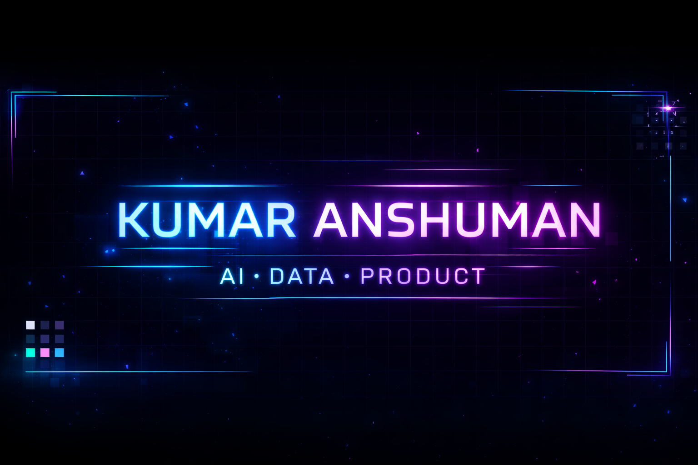

# Hi 👋 I'm Anshuman Kumar

### 🚀 AI • Data • Product

---

# 🌟 About Me

* 🧠 Interested in **AI, Data Science, and Product Management**
* 🏆 **Top 2 National Finalist — NEST 2.0 Hackathon**
* 📊 Passionate about **data-driven decision making**

---

# ⚡ Tech Stack

### Programming

### Tools

### Data & AI

---

# 🚀 Featured Projects

🔹 **Credit Risk Prediction Model**  
Machine learning model to identify high-risk credit card users.

🔹 **Fraud Detection System**  
Isolation Forest based anomaly detection for financial transactions.

🔹 **Financial Analytics Dashboard**  
Data dashboard for visualizing financial KPIs.

---

# 📊 GitHub Stats

---

# 🔥 GitHub Streak

---

## 📊 GitHub Overview

---

# 📊 Contribution Graph

---

# 🐍 Contribution Snake

---

# 🤝 Connect With Me

---

⭐️ From [Kumar Anshuman](https://github.com/anxhumandev)

